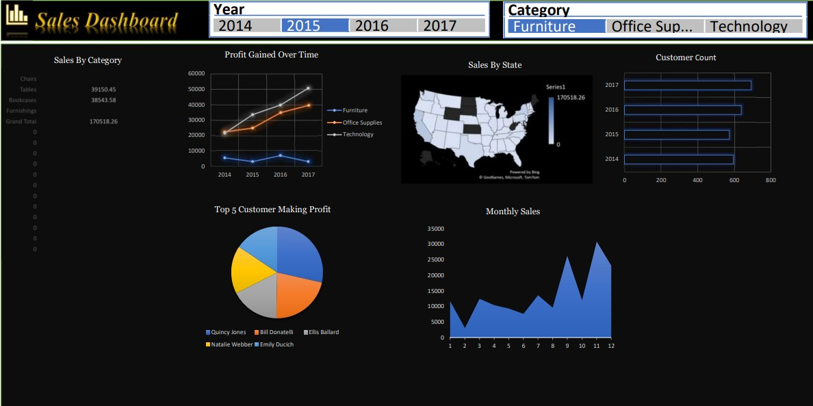

# SALES-ANALYSIS-USING-EXCEL

This project demonstrates proficiency in Microsoft Excel, encompassing various features and techniques for data analysis, visualization, and dashboard creation, essential for informed decision-making and business strategy formulation.

Implemented advanced data manipulation and visualization techniques using Microsoft Excel to extract actionable insights from complex datasets. Key contributions include:

# **Data Transformation:** 
Utilized Excel's Table feature to convert raw data into structured tables, enabling easier data management and analysis. Introduced Month & Year columns to enhance temporal analysis.

# **Data Cleansing:** 
Employed data cleansing techniques to remove duplicate values and eliminate blank cells, ensuring data integrity and accuracy for subsequent analysis.

# **Sales Analysis:** 
Leveraged Pivot Tables to analyze sales trends by category, facilitating informed decision-making. Developed a dynamic Funnel Chart to visually represent sales progression across different categories.

# **Profit Analysis:** 
Created Pivot Tables to analyze profit gained over multiple years and across various categories, providing insights into profitability trends and performance evaluation.

# **Monthly Sales Analysis:** 
Developed Pivot Tables for monthly sales analysis, enabling the observation of sales fluctuations over time. Utilized slicers and 2D area charts to visualize monthly sales trends by year.

# **Customer Profitability Insights:** 
Generated charts to identify top 5 customers by profit, aiding in strategic customer relationship management. Implemented 2D pie charts for clearer visualization of customer profitability distribution.

# **Geospatial Analysis:** 
Utilized map charts to visualize sales distribution by state, providing geographical insights for targeted marketing strategies and regional performance evaluation.

# **Customer Engagement Analysis:** 
Created pivot tables for customer count analysis by year, enabling insights into customer engagement dynamics. Developed bar charts to visualize customer count trends, facilitating the formulation of customer retention strategies.

# **Dynamic Dashboard Creation:** 
Integrated all analyses into a dynamic dashboard, providing stakeholders with a comprehensive overview of sales performance, profitability, customer engagement, and geographic distribution. Enabled interactive exploration of data insights for informed decision-making and strategy formulation.
